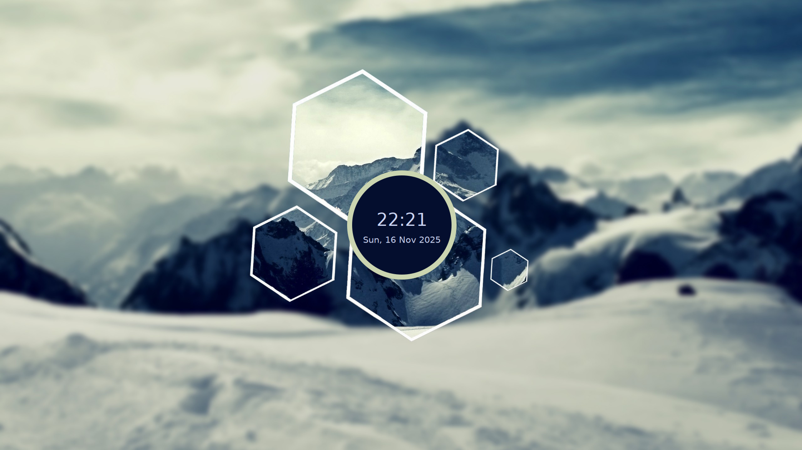
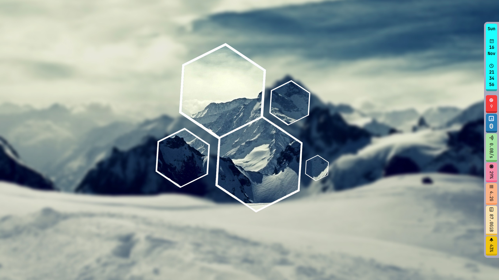
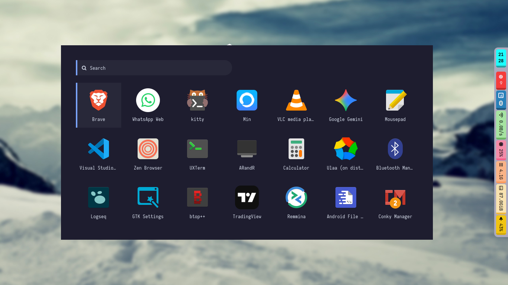
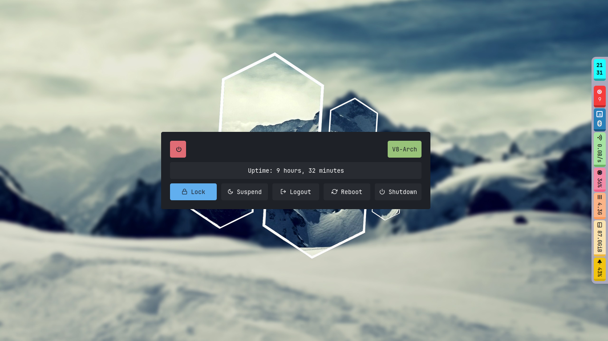
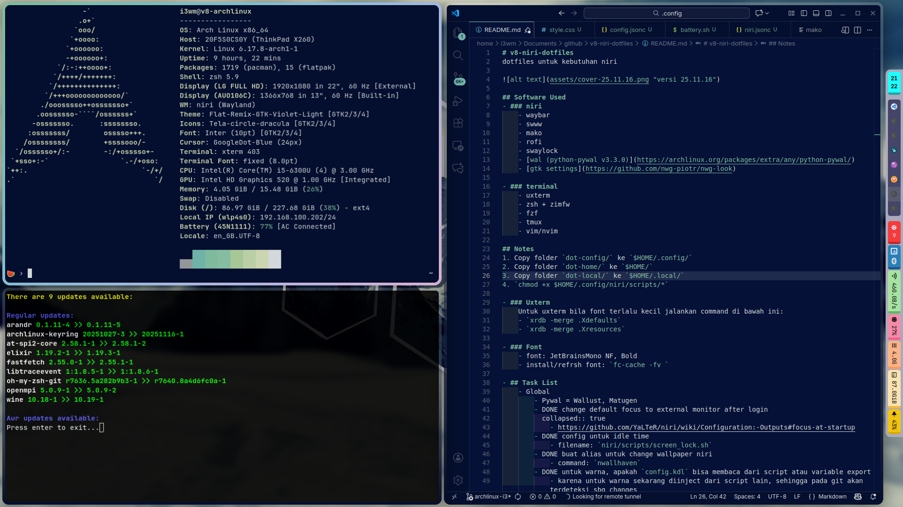
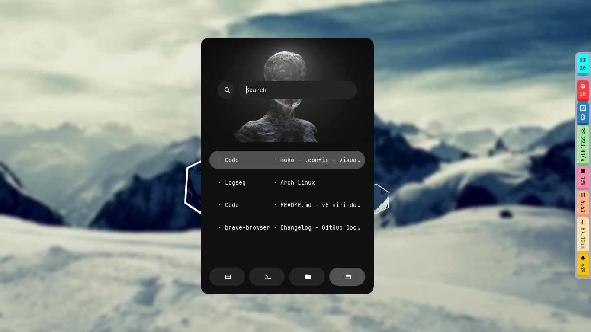
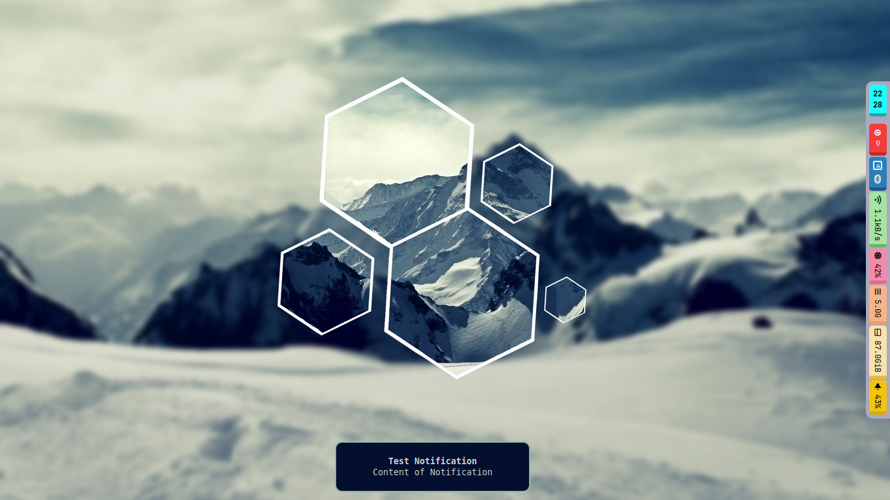

# v8-niri-dotfiles
dotfiles untuk kebutuhan niri

## Software Used
- ### niri
    - waybar
    - swww
    - mako
    - rofi
    - swaylock
    - swayidle
    - [wal (python-pywal v3.3.0)](https://archlinux.org/packages/extra/any/python-pywal/)
    - [gtk settings](https://github.com/nwg-piotr/nwg-look)
    - wallpaper source: wallhaven

- ### terminal
    - uxterm
    - zsh + zimfw
    - fzf
    - tmux
    - vim/nvim

## Notes
1. Copy folder `dot-config/.` ke `$HOME/.config/`
2. Copy folder `dot-home/.` ke `$HOME/`
3. Copy folder `dot-local/.` ke `$HOME/.local/`
4. `chmod +x $HOME/.config/niri/scripts/*`

- ### Uxterm
    Untuk uxterm bila font terlalu kecil jalankan command di bawah ini:
    - `xrdb -merge .Xdefaults`
    - `xrdb -merge .Xresources`

- ### Font
    - font: JetBrainsMono NF, Bold
    - install/refresh font: `fc-cache -fv `

## Version: 25.11








## Changelog
- ### v25.11
	- Global
		- Pywal = Wallust, Matugen
		- change default focus to external monitor after login
			- https://github.com/YaLTeR/niri/wiki/Configuration:-Outputs#focus-at-startup
		- config untuk idle time
			- filename: `niri/scripts/screen_lock.sh`
		- buat alias untuk change wallpaper niri
			- command: `nwallhaven`
		- untuk warna, apakah `config.kdl` bisa membaca dari script atau variable export
			- karena untuk warna sekarang diinject dari script lain, sehingga pada git akan terdeteksi sbg changes
			- solution:
				- 1. membuat file config_base.kdl dan ditambahkan ke git
				- 2. buat file config.kdl exclude dari git
				- 3. script perubahan warna, hanya akan inject ke config.kdl
		- Window Rules
			- app-id: Code, open maximized true
			- app-id: Logseq, open maximized true
	- Waybar
		- DEBUG: `GTK_DEBUG=interactive waybar`
		- wallhaven, auto read image extension when downloading (jpg or png)
		- add `makoctl reload` in wallhaven, to refresh color
		- config untuk vertical bar
		- add info related to package update
			```bash
			.config/polybar/Updates --update-system
			.config/polybar/Updates --print-updates
			```
	- Mako
		- Styling and set auto hide    
			- testing trigger notif: ` notify-send "TEST" "BODY"  `
			- config file: `.config/mako/config`
			- setelah melakukan perubahan config, ketik `makoctl reload`
---
<p align="center">
created: 16 Nov 2025 | updated: 16 Nov 2025
<br />
Tangerang, Banten
<br />
Indonesia
</p>
