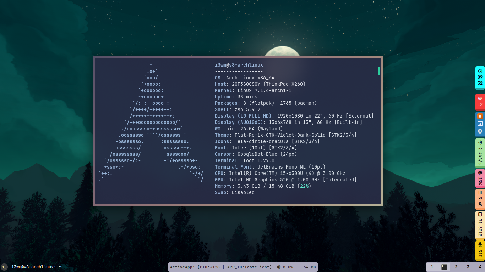
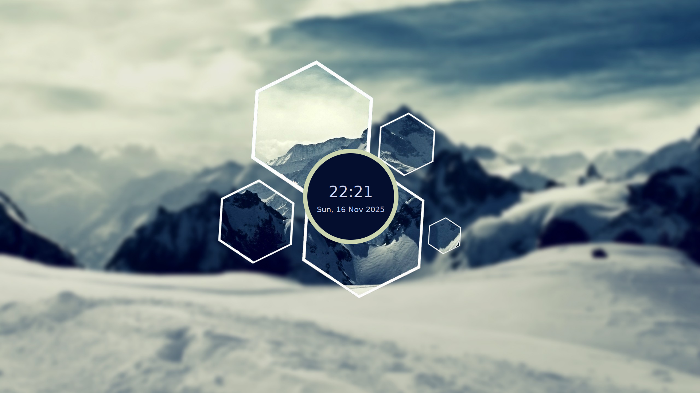
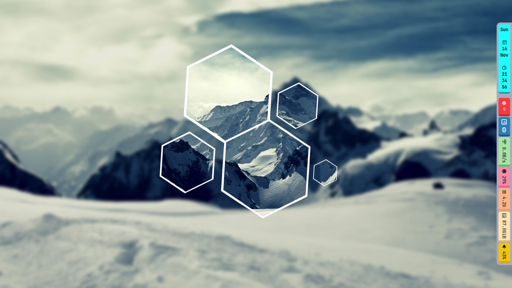
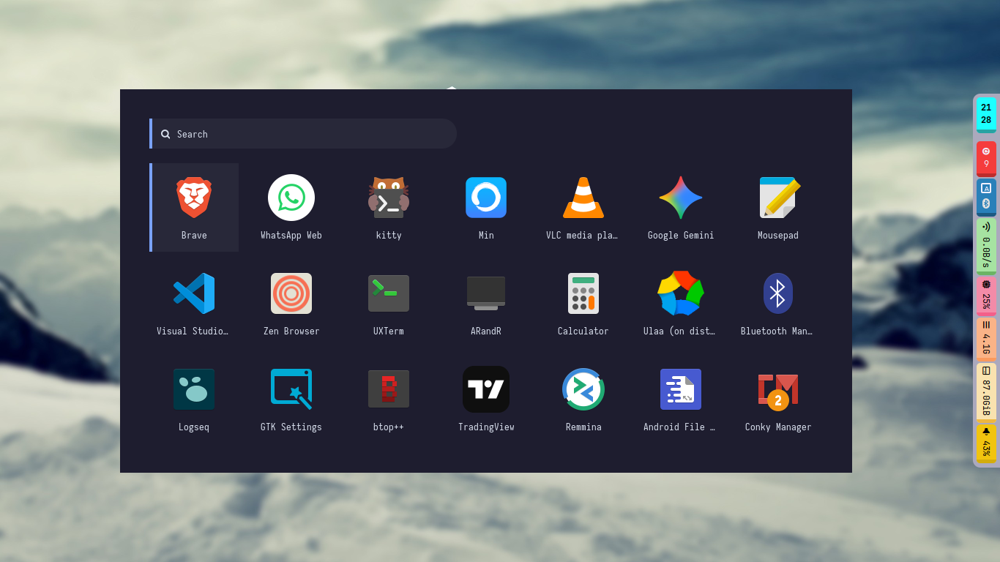
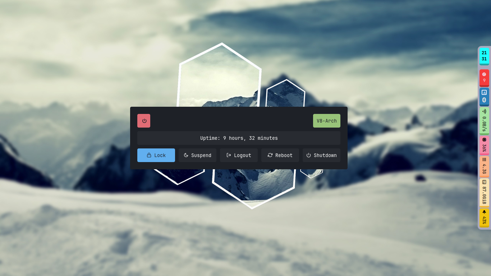
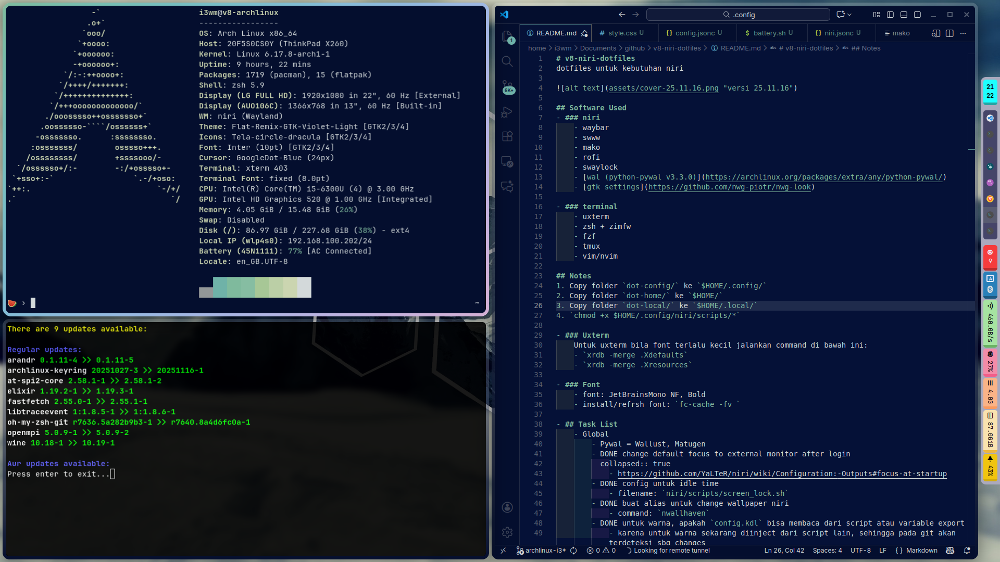
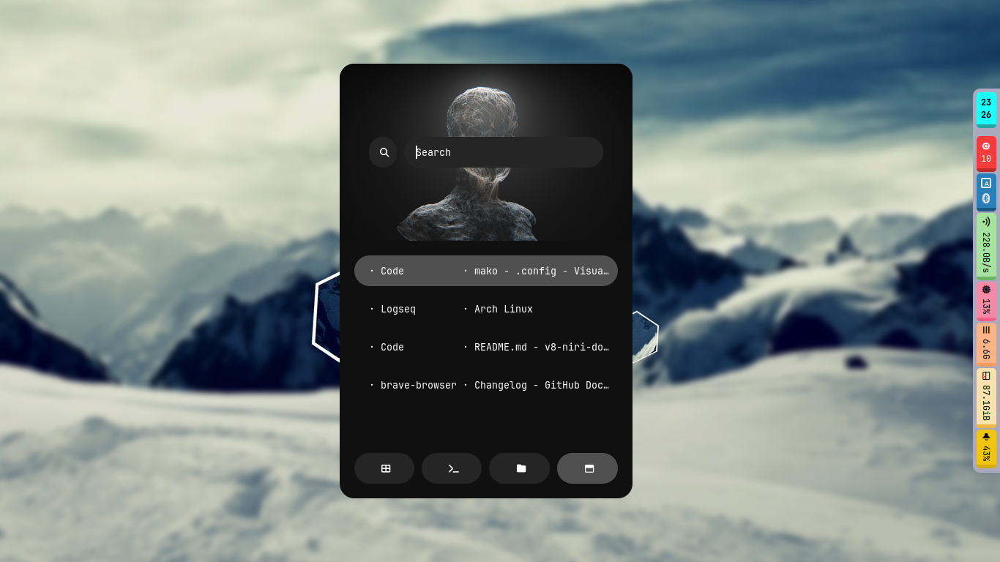
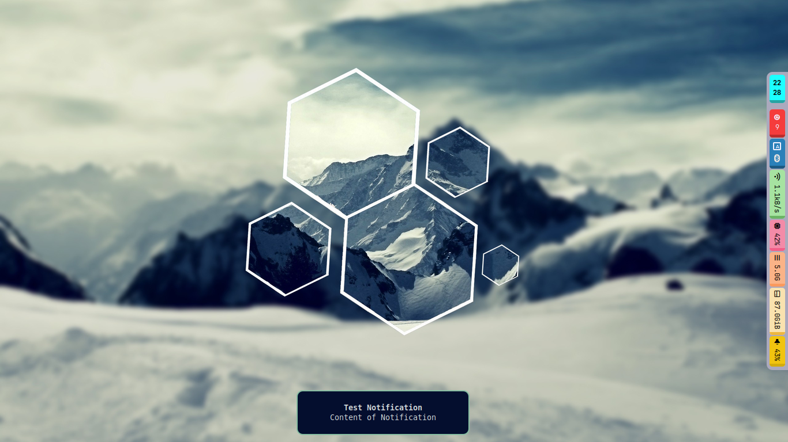

## Software Used
- ### niri
    - waybar
    - awww
    - mako
    - rofi
    - swaylock
    - swayidle
    - [wal (python-pywal v3.3.0)](https://archlinux.org/packages/extra/any/python-pywal/)
    - [gtk settings](https://github.com/nwg-piotr/nwg-look)
    - wallpaper source: wallhaven
    - wallpaper automation: `wall_auto_wallhaven.sh` (alias: `nwallhaven`)

- ### terminal
    - ~~uxterm~~ foot
    - zsh + zimfw
    - fzf
    - tmux
    - vim/nvim

## Wallpaper Automation
Script: `wall_auto_wallhaven.sh` (alias: `nwallhaven`)
Usage: `nwallhaven [day|night|query:SEARCH_QUERY|IMAGE_ID]`

- `nwallhaven` (no arg): Auto-detects day/night based on time.
- `nwallhaven day`: Force day mode.
- `nwallhaven night`: Force night mode.
- `nwallhaven query:SEARCH`: Search for specific images (e.g., `query:cyberpunk`).
- `nwallhaven ID`: Download specific Wallhaven image ID.

## Notes
1. Copy folder `dot-config/.` ke `$HOME/.config/`
2. Copy folder `dot-home/.` ke `$HOME/`
3. Copy folder `dot-local/.` ke `$HOME/.local/`
4. `chmod +x $HOME/.config/niri/scripts/*`

- ### Security Check (aur-security-check)
    Wrapper `aur-security-check` digunakan saat menjalankan `paru -Syu` untuk menambahkan validasi keamanan AUR sebelum proses update berjalan. Berfungsi untuk memverifikasi integritas build dan mendeteksi potensi malicious scripts pada package AUR sebelum diinstall.

    Referensi: `~/Documents/OpenCode/aur-security/aur-security-check`

- ### Uxterm
    Untuk uxterm bila font terlalu kecil jalankan command di bawah ini:
    - `xrdb -merge .Xdefaults`
    - `xrdb -merge .Xresources`

- ### Font
    - font: JetBrainsMono NF, Bold
    - install/refresh font: `fc-cache -fv`

- ### Config Base (Dynamic Colors)
    - `config_base.kdl` = git-tracked source of truth
    - `config.kdl` = generated at runtime (excluded from git)
    - Color injection script reads `config_base.kdl`, applies pywal/matugen colors, writes `config.kdl`

## Version: 26.07

## Version: 26.03
- Add glitch and smoke animation (GLSL shaders)
- Ref:
    - https://www.reddit.com/r/niri/comments/1s2u6mq/i_found_out_niri_has_glsl_support_for_animations/
    - https://github.com/liixini/shaders
- Introduce `config_base.kdl` as git-tracked source

## Version: 25.11

## Changelog
- ### v26.07
    - Add Waybar bottom (dock-mode) bar and modified vertical bar
    - `wall_auto_wallhaven.sh` improve code and add more arguments as parameter
    - Polybar: `Updates --update-system` wrapped with `aur-security-check`

- ### v26.03
    - Add animation glitch and smoke   
        - https://www.reddit.com/r/niri/comments/1s2u6mq/i_found_out_niri_has_glsl_support_for_animations/
        - https://github.com/liixini/shaders

    - Introduce `config_base.kdl` as git-tracked source, `config.kdl` excluded for dynamic color injection
    - change uxterm to foot

- ### v25.11
    - Global
        - Pywal → Wallust, Matugen
        - Change default focus to external monitor after startup
            - https://github.com/YaLTeR/niri/wiki/Configuration:-Outputs#focus-at-startup
        - Config untuk idle time (`niri/scripts/screen_lock.sh`)
        - Alias untuk change wallpaper: `nwallhaven`
        - Dynamic color solution: `config_base.kdl` (git) + `config.kdl` (excluded, injected)
        - Window Rules: Code/Logseq open maximized
    - Waybar
        - DEBUG: `GTK_DEBUG=interactive waybar`
        - Wallhaven: auto detect image extension (jpg/png)
        - Add `makoctl reload` in wallhaven to refresh color
        - Config untuk vertical bar
        - Package update info: `.config/polybar/Updates --update-system | --print-updates`
    - Mako
        - Styling and set auto hide
        - Test notif: `notify-send "TEST" "BODY"`
        - Config: `.config/mako/config` → reload: `makoctl reload`

---

created: 16 Nov 2025 | updated: 26 Jul 2026
 
Tangerang, Banten
 
Indonesia

